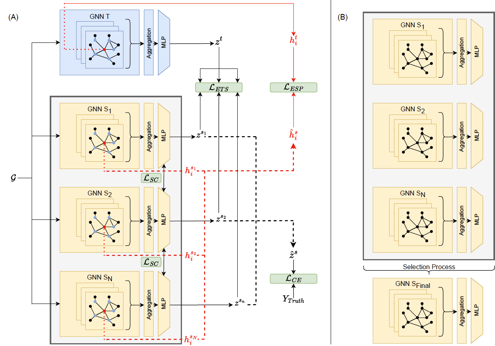

# Reproducibility aware Knowledge Distillation for GNN

This is the code repository for the master's thesis titled "Reproducible Knowledge Distillation on Graphs." 
This repository contains the codebase used to implement and demonstrate the methodologies presented in my thesis project, conducted at Imperial College London. 

At the heart of this project is our novel proposed method, **Reproducibility Aware Knowledge Distillation on Graphs (RepKD)**. 
RepKD is designed to transfer knowledge from a large pre-trained teacher GNN to a smaller GNN student while preserving reproducibility for graph classification tasks. 
The method introduces a two-step framework, as depicted in the figure, comprising of two steps:

- **Reproducibility Aware Knowledge Distillation Process**: This step encompasses the knowledge transfer process from the teacher to the student while ensuring the reproducibility of the student models.

- **Student Selection Process**: The second step involves selecting the final GNN student model for inference.



## Usage

### Running the Code

To run the code and reproduce the results of the thesis, follow these steps:

1. **Clone the Repository**: Start by cloning this repository to your local machine:

   ```git clone https://github.com/your-username/thesis-imperial.git```
   
2. Navigate to the Project Directory: Change your working directory to the root of the cloned repository:

   ```cd thesis-imperial/src```

3. Install Dependencies: Ensure you have Python 3.9.7 installed. It's recommended to use a virtual environment:
  
    ```
    python3 -m venv venv
    source venv/bin/activate
    ```
4. Install Required Packages: Install the required packages using pip:
  
    ```
    pip install -r requirements.txt
    ```

### Version of Python

This project was developed and tested using Python 3.9.7. It is recommended to use this version or a compatible version for optimal compatibility.

## How to Use the Demo

Once the virtual enviroement is created and activated in order to run the demo you need:

1. Update the  ```demo/config.py``` file such that it reflects your directory structure. 

2. Once this is done you can run the demo, which is similpy found in the following notebook: ```demo/demo.ipynb```

## How to Replicate Results

Once the virtual enviroement is created and activated in order to run the demo you need:

1. Update the  ```utils/config.py``` update this file such that it reflects your directory structure.
2. Update the virtual enviroment directory in all of the bash files (.sh) in ```scripts```
3. Once these have been updated, run the scripts sequentially, more information can be found in  ```scripts/readme.txt```

## Directory Structure

Here is an overview of the directory and file structure of the project:

| Directory/File   | Description                                                           |
|------------------|-----------------------------------------------------------------------|
| models/          | Contains GNN model implementations and definitions for GCN [https://arxiv.org/abs/1710.10903] and GAT [https://arxiv.org/abs/1609.02907]                      |
| models_config/   | Stores configuration files for different model architectures for knowledge distilation methods used in main_*.py files.        |
| notebooks/       | Contains Jupyter notebooks used for experimentation and visualization throughout thesis.    |
| scripts/         | Holds scripts that can be run to replicate results for thesis.                |
| trainers/        | Contains training code for all knowledge distillation methods baselines (vanilla KD, FitNet, LSP and MSKD) as well as RepKD training method (rep_kd_ensemble/) for ensemble sizes of 2, 3, 4 or 5.                   |
| utils/           | Stores utility functions and helper modules, used to create datasets and for analysis.                        |
| demo/            | Holds a demonstration example of how to use the proposed method.     |
| data_unprocessed/             | Holds unprocessed data to be used with ```builder.py``` |
| data/             | Holds processed data after using ```builder.py``` or the demo (created automatically) |
| model_data/ | Directory which holds the data of trained models for anaylsis, created with demo or replicating results (created automatically)| 

## Explanation of main_*.py Files

Here is an explanation of the main `main_*.py` files used to train each model, along with their associated purposes and methods:

| File Name                     | Purpose and Method                                                       |
|-------------------------------|--------------------------------------------------------------------------|
| main_rep_kd.py                | Implements our proposed Reproducible Knowledge Distillation method.      |
| main_cross_validation.py      | Used for pre-training teacher models and student models without KD distillation. |
| main_vanilla_kd.py            | Implements the Vanilla Knowledge Distillation method.                    |
| main_fitnet.py            | Implements the FitNet Knowledge Distillation method.                    |
| main_lsp.py                   | Implements the LSP knowledge distillation method.                       |
| main_mskd.py                  | Implements the MSKD (Multi-Source Knowledge Distillation) method.         |
| main_ensemble_logits.py       | Implements an ensemble technique using logits aggregation.               |
| main_ensemble_emb.py          | Implements an ensemble technique using embeddings aggregation.           |

These `main_.py` files are used as the main functions to train various models in your project. They correspond to different knowledge distillation methods and ensemble techniques. Additionally, the `model_config` files are used in conjunction with these scripts to configure model architectures and training parameters.
If custom model configurations need to be defined in the one of the files in `model_config` directory, then imported into the approiriate model you want to train.

Refer to the specific `main_*.py` files for detailed implementation and usage instructions.

